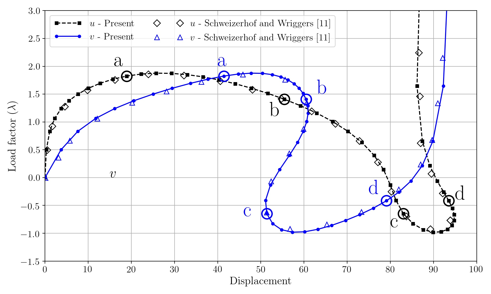
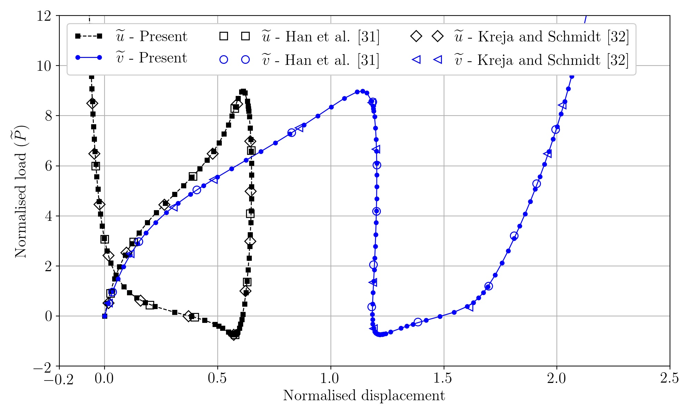
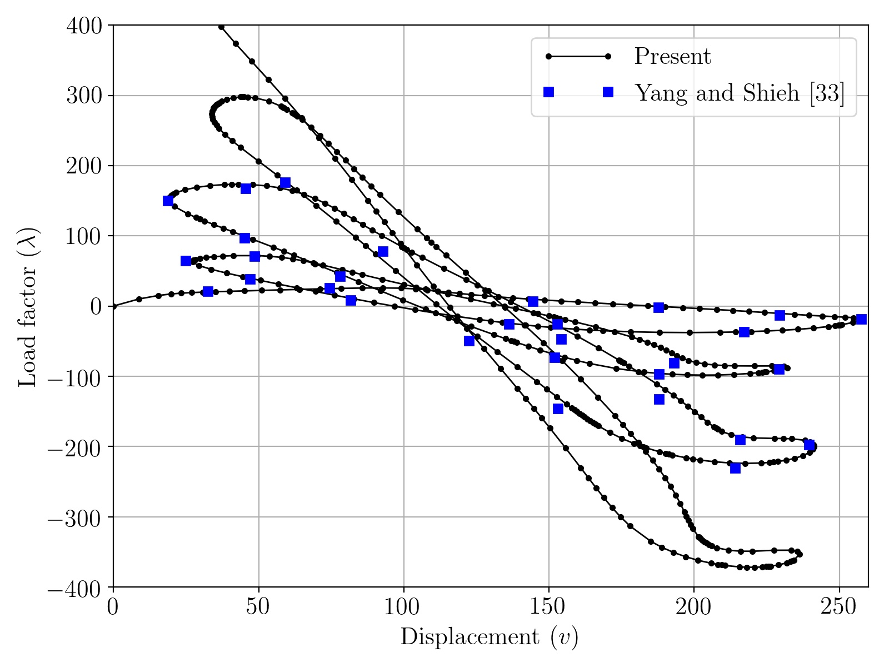

GNU Octave scripts for the arc-length method.
This implementation is based on a novel a extrapolated predictor.

The main script is **main_arclength.m**. The input files are prepared and tested.
Uncomment the corresponding line in the main file to run the script for a particular problem.

Some load-displacement curves computed with this code.

* Lee frame

* 215-degree circular arch

* Semi-circular arch with asymmetric loading

